# Taller ArduinoEsp8266 y Ubidots

## instrucciones

### Creación cuenta en Ubidots
1. Ingrese a la página de uBidots [app.ubidots.com](https://app.ubidots.com) y registrese (pestaña SING UP).
2. En la pagina de uBidots, seleccione la pestaña "Device" y luego haga click en "Add Device" como se muestra en la siguiente figura.


Luego asigne un nombre representativo al nuevo dispositivo. Esto creará una representación de nuestra tarjeta Esp8266 en nuestra cuenta de uBidots.

3. A continuación, haga click en el dispositivo recién creado y agregue una variable para guardar la temperatura medida por el sensor: click en "Add Variable", seleccione la opción "Default" y nombrela como "temperatura".

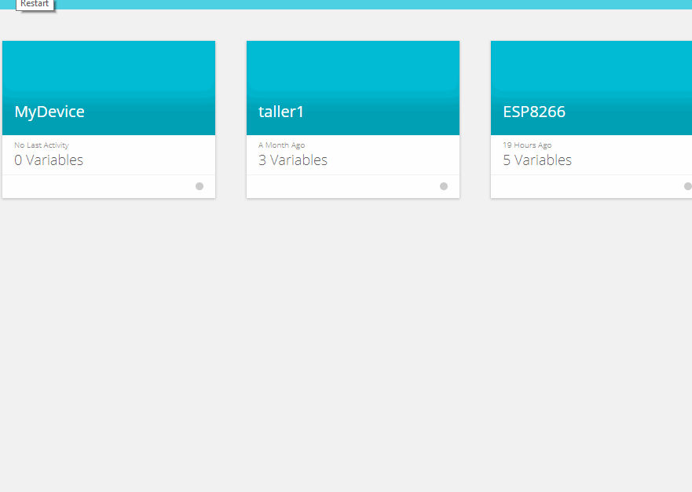
4. Genere otra variable llamada "humedad".

5. Por último, cree una tercera variable llamada "led".

6. A continuación, en la pestaña llamada "Dashboards", agregue un nuevo dashboard para su dispositivo, esto le permitirá visualizar y controlar los valores de sus variables. Cree un nuevo Dashboard, nombrelo adecudamente y luego haga click en él como se muestra en la figura.
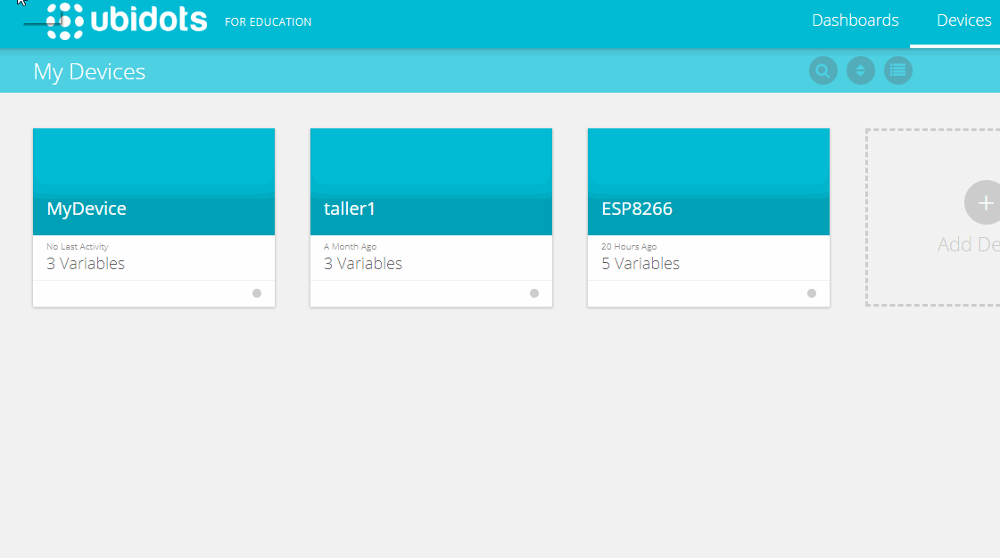

7. Luego cree un "Widget" que nos permita observar la variable temperatura, para ello haga click en el icono , luego haga click en el tipo de indicador llamado "indicator" , luego seleccione el tipo de indicador llamado "Gauge" y a continuación seleccione el dispositivo anteriormente creado, finalmente seleccione la variable temperatura del dispositivo e indique los valores máximos y mínimos permitidos, en este caso seleccione -10 y 45 (estos serán los límites en grados celsius). En la siguiente figura se muestra el procedimiento.
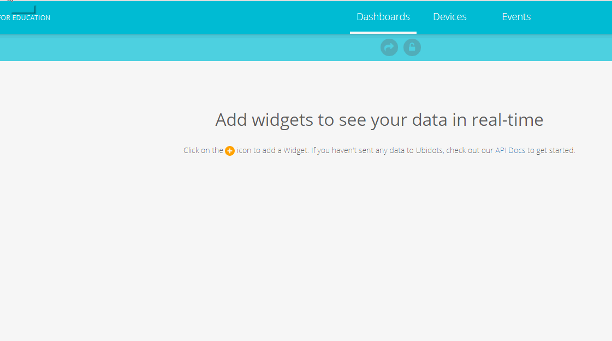

8. De la misma forma, cree un widget para la variable humedad, con límites entre 0 y 100.

9. Finalmente cree otro widget del tipo switch para controlar la variable led. Haga clic en el icono , luego seleccione la clase de widget llamada "Control", a continuacion seleccione el tipo de widget llamado "switch" y luego elija el dispositivo anteriomente creado, seleccione la variable y haga click en el boton "finish".
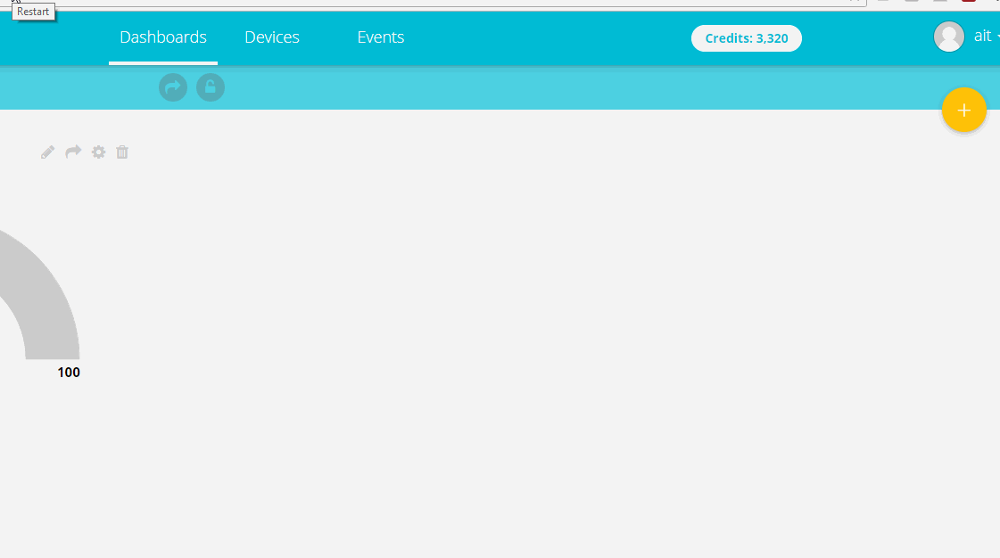

### Cableado y Programación de la tarjeta ESP8266

1. Arme el circuito de la siguiente figura para conectar el sensor de temperatura y humedad a la tarjeta.


2. Conecte la tarjeta ESP8266 a su computador mediante un cable micro usb, deberá observar que el led del sensor se encienda inmediatamente, si esto no sucede, desconecte de inmediato y revise sus conexiones. Luego mueva el interruptor de la tarjeta a la posición "ON".

3. Abrir el programa IDE de Arduino y configurarlo para la tarjeta utilizada, primero en el menu seleccione Herramientas->Placa->"sparkFun ESP8266 Thing Dev", luego seleccionar el puerto de comunicaciones en Herramientas->puerto->comX (la X es reemplazada según el número que aparesca en cada computador).


4. Descargue este proyecto, para ello suba al inicio de esta página y pinche el botón verde llamando "clone or download" y pinche la opción "download ZIP" como se muestra en la siguiente figura.
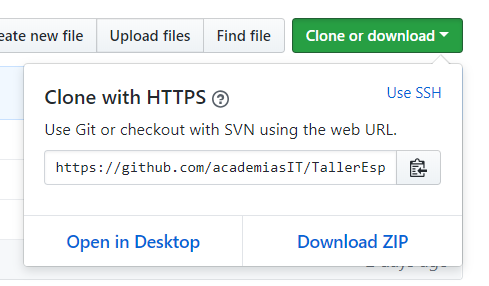

5. Luego de descargar el proyecto, abra el archivo `arduino_ubidots/arduino_ubidots.ino` mediante el menu `Archivo->abrir...` .

6. Es necesario agregar algunas librerias al proyecto para tener acceso ap API de uBidots desde arduino. Haga click en este [link](https://github.com/ubidots/ubidots-esp8266) y descargue la librería mediante el boton verde llamado "clone or download" y luego haga click en "downlaod as ZIP" como se indica en la siguiente figura.

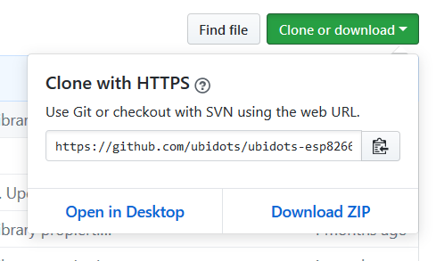

7. Luego en el ide arduino, ir al menu programa->incluir libreria->añadir libreria ZIP como se muestra en la figura.
En el cuadro de dialogo que se abrirá, busque la librería de ubidots en formato zip que acaba de descargar.

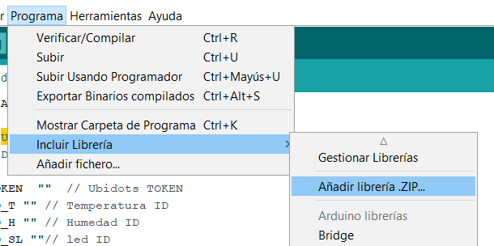


8. Para trabajar con el sensor DHT11, es necesario descargar primero la librería `Adafruit_Sensor.h` desde el siguiente [link](https://github.com/adafruit/Adafruit_Sensor). Tal como en la descarga de la librería anterior, seleccione el botón "clone or download" y luego haga click en "download zip".

9. agregue la librería `Adafruit_Sensor.h` en formato ZIP al ide arduino tal como se hizo con la librería de uBidots.

10. Finalmente agregue la libreria específica para el sensor DHT11 (nuestro sensor de temperatura y humedad), mediante el menu programa->incluir libreria->gestionar libreria y luego escribir en el cuadro de búsqueda el texto DHT11. Seleccione el resultado "DHT Sensor Library by Adafruit" y luego haga click en instalar.
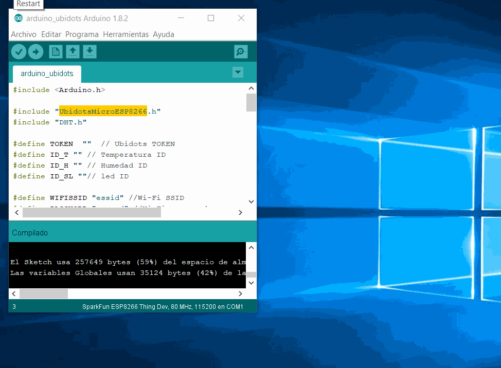

11. Modifique el programa con los datos necesarios para la conexión WiFi. Modifique las lineas de código al comienzo del archivo: `#define WIFISSID "essid"` reemplazando la palabra essid por el nombre de su red, también modifique la línea `#define PASSWORD "passwd"` reemplazando passwd por la clave de la red.

12. Para que nuestra tarjeta pueda enviar y recibir datos desde las variables en uBidots, es necesario que se obtengan las ID's de cada variable. Para ello dentro de la cuenta de ubidots seleccione la pestaña "Devices" y luego su dispositivo, finalmente seleccione la variable deseada y la id de esta aparecerá en la ficha de la esquina izquierda, guarde esta id. En la siguiente figura de ejemplifica el procedimiento con la variable temperatura.
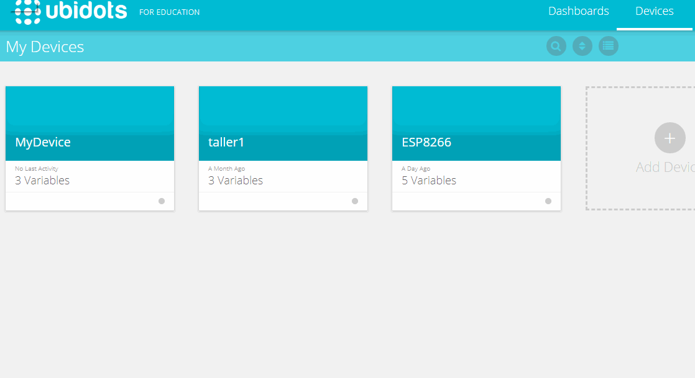

13. También es necesario obtener el token de usuario de ubidots, para ello haga click en el usuario en la esquina superior derecha y luego "Api Credentials", seleccione en la sección "Tokens" un token, por ejemplo el llamado "Default token" y guarde este código. En la siguiente figura se ejemplifica este procedimeinto.
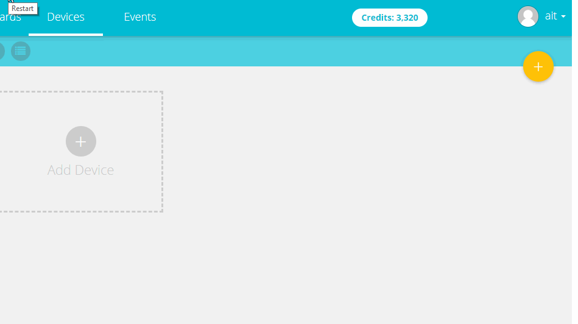

14. en el archivo `arduino_ubidots.ino`, modifique las siguientes líneas al inicio del archivo:
`#define TOKEN  ""`, pegue entre las comillas el token de usuario de ubidots, en `#define ID_T ""` pegue entre las comillas el id de la variable temperatura, en `#define ID_H ""` pegue entre las comillas el id de la variable humedad y finalmente en `#define ID_SL ""` pegue el id de la variable led.

15. Presione el botón  del Ide de Arduino para compliar el programa y cargarlo a la tarjeta, esto tomará un poco de tiempo. Si todo ha salido bien, usted podrá ver los niveles de temperatura y humedad de la sala desde el dashboard de ubidots, también podrá controlar el led de la tarjeta presionando el switch llamdo "led" del dashboard.

### Desafío de Programación
Es esta parte de la actividad, utilice lo aprendido para agregar un nuevo elemento, en este caso un servomotor, y realizar todos las madificaciones al proyecto para controlarlo desde uBidots.

__**Nota**__: Un motor eléctrico normal gira continuamente, mientras que un servomotor es un motor controlado de manera electrónica, lo que permite mover el eje del motor un ángulo determinados de manera precisa.

1. Conecte el Servomotor al arduino como se muestra en la figura siguiente.
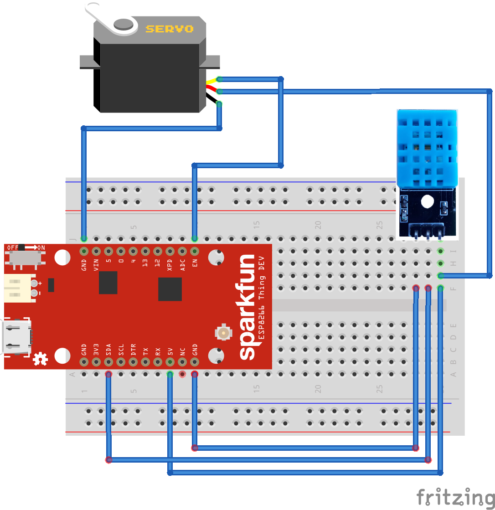

2. Ahora cree una nueva variable en uBidots, la cual tendrá el ángulo del eje del servomotor. Como el ángulo de giro de este servo es de 0 a 180 grados, su variable deberá tener como límite mínimo 0 y como límite máximo 180.

3. Agregue al dashboard de uBidots un control tipo "slide" y asócielo con la variable del servomotor. Con este control usted podrá mover el eje del motor desde uBidots.

4. En esta parte deberá modificar el código de arduino para leer la variable del servomotor desde uBidots y mover el eje en el ángulo especificado por esta variable. Fijese en como el código maneja el Led, esto le ayudará a escribir las lineas necesarias para controlar el servo desde uBidots. Además, considere el siguiente código en arduino que mueve el eje del motor en un determinado ángulo (en este caso 90), utilicelo de referencia para agregar en su código las líneas necesarias para controlar el servomotor:

```
#include <Servo.h>

Servo myservo;  //crea un objeto que representa al servomotor

void setup() {
  myservo.attach(15); //el servo esta conectado al pin 15 del arduino
}

void loop() {
  int ang = 90; // ángulo en que se moverá el eje del servo
  myservo.write(ang); //envia al servo el ángulo de giro requerido
}
```
